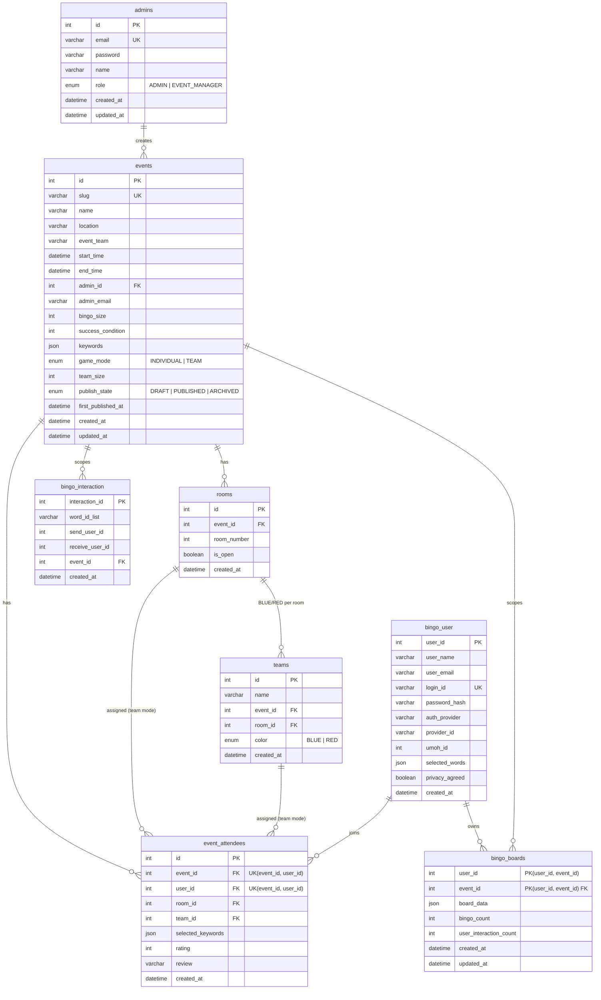

# DB Schema (2026-03-26)

```mermaid
erDiagram
    admins {
        int id PK
        varchar email UK
        varchar password
        varchar name
        enum role "ADMIN | EVENT_MANAGER"
        datetime created_at
        datetime updated_at
    }

    events {
        int id PK
        varchar slug UK
        varchar name
        varchar location
        varchar event_team
        datetime start_time
        datetime end_time
        int admin_id FK
        varchar admin_email
        int bingo_size
        int success_condition
        json keywords
        enum game_mode "INDIVIDUAL | TEAM"
        int team_size
        enum publish_state "DRAFT | PUBLISHED | ARCHIVED"
        datetime first_published_at
        datetime created_at
        datetime updated_at
    }

    rooms {
        int id PK
        int event_id FK
        int room_number
        boolean is_open
        datetime created_at
    }

    teams {
        int id PK
        varchar name
        int event_id FK
        int room_id FK
        enum color "BLUE | RED"
        datetime created_at
    }

    bingo_user {
        int user_id PK
        varchar user_name
        varchar user_email
        varchar login_id UK
        varchar password_hash
        varchar auth_provider
        varchar provider_id
        int umoh_id
        json selected_words
        boolean privacy_agreed
        datetime created_at
    }

    event_attendees {
        int id PK
        int event_id FK "UK(event_id, user_id)"
        int user_id FK "UK(event_id, user_id)"
        int room_id FK
        int team_id FK
        json selected_keywords
        int rating
        varchar review
        datetime created_at
    }

    bingo_boards {
        int user_id "PK(user_id, event_id)"
        int event_id "PK(user_id, event_id) FK"
        json board_data
        int bingo_count
        int user_interaction_count
        datetime created_at
        datetime updated_at
    }

    bingo_interaction {
        int interaction_id PK
        varchar word_id_list
        int send_user_id
        int receive_user_id
        int event_id FK
        datetime created_at
    }

    admins ||--o{ events : creates
    events ||--o{ rooms : has
    rooms ||--o{ teams : "BLUE/RED per room"
    events ||--o{ event_attendees : has
    rooms ||--o{ event_attendees : "assigned (team mode)"
    teams ||--o{ event_attendees : "assigned (team mode)"
    bingo_user ||--o{ event_attendees : joins
    bingo_user ||--o{ bingo_boards : owns
    events ||--o{ bingo_boards : scopes
    events ||--o{ bingo_interaction : scopes
```
